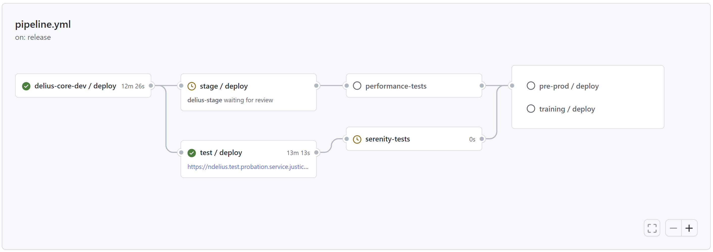

# Delius Releases

[](https://github.com/ministryofjustice/delius-releases/actions/workflows/pipeline.yml)

Automated deployment pipeline for the National Delius probation case management system, built by Unilink to improve the speed and quality of releases.
This repository also acts as a central place to store and access the [release notes](release-notes).

* **[View the latest releases and deployments here](https://github.com/ministryofjustice/delius-releases/actions/workflows/pipeline.yml)**

> :memo: This project is a work-in-progress and subject to change.

## Pipeline



To trigger the pipeline:
1. Unilink build Delius and verify it in their system test environments
2. Unilink release Delius by uploading and tagging the release note in this repository

Then, the pipeline will automatically:

3. Deploy to the MOJ development environments
4. Notify environment owners via Slack/email, then wait for approval
5. Deploy to the MOJ test environments
6. Run the Delius functional and performance tests against the release
7. Deploy to the MOJ pre-production environments
   
   Note: deployment to production will be manually scheduled and performed out of hours.

Any deployment failures will trigger an alert to the NDST Slack channel.

## Approvals
Deployment to the development environments is automatic, however other environments are subject to manual approval.

To configure who can approve deployments in each environment, go to https://github.com/ministryofjustice/delius-releases/settings/environments.
Each approver will receive an email whenever a deployment is pending, with a link to approve or reject the deployment and add any comments.

Example:

<p align="center"><a href=".docs/approval.gif"></a></p>

## Slack Integration
To enable notifications for releases, approvals and deployments, type the following in the desired Slack channel:
```
/github subscribe ministryofjustice/delius-releases
/github unsubscribe ministryofjustice/delius-releases commits
/github unsubscribe ministryofjustice/delius-releases pulls
```

Example:

<p align="center"><a href=".docs/slack.png"></a></p>

## Support
If you have any questions feel free to get in touch via Slack: ([#TODO pick a slack channel](TODO)), or create a [GitHub issue](https://github.com/ministryofjustice/delius-releases/issues/new) in this repository.
